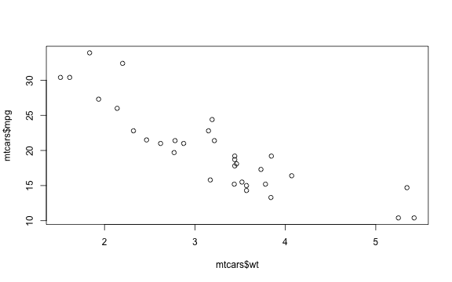
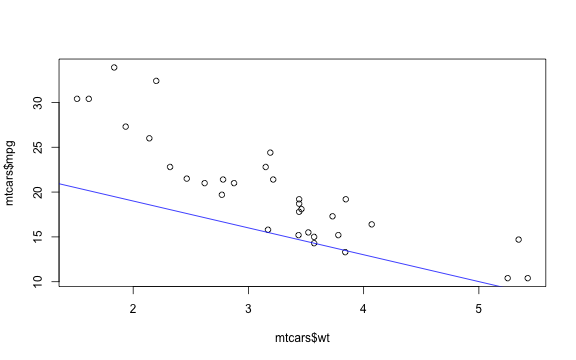
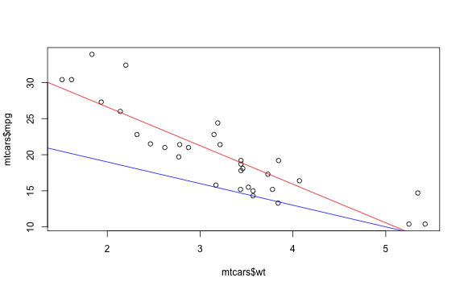

## Interactive Linear Regression
Coursera Data Products Project Application</br>
Chris Eagle

--- 

### Abstract 
The purpose of the application is to provide the user with a fun
way to explore linear regression.</br></br>
R's "Mtcars" dataset contains a series of variables relating to motor cars that can be plotted to explore correlation, with a linear regression model fitted to the points.</br></br>
The user can change the slope and intercept of the regression line, adjusting to find the best fit. With each adjustment to the line, the mean squared error is calculated,</br> to show how good the fit is.</br>S/he can then reveal the actual line of best fit produced by the fitted linear model.

--- 

### Inputs 1: Plot variables
The user can choose any of the variables from the 'mtcars' dataset from two drop-down menus. The plot then updates to display these variables, with a description of each variable under the plot.
For example, when selecting 'mpg' and 'wt':</br>
 


--- 

### Inputs 2: Slope and Intercept
The user can then adjust two slider inputs - one for the slope, one for the intercept of a line drawn through the point on the plot. The min and max values on the sliders adjust dynamically based on the range of values for the variable in question.</br>
 

--- 

### Accuracy: Mean Squared Error
As the user adjusts the slope and intercept of the line of fit, the mean squared error for the line is calculated and displayed. The user can then see whether subsequent adjustments lead to a more or less accurate fit.</br>
 
</br>The mean squared error of our example line is:</br>

```
## [1] 36.28551
```

--- 

### Solution
Finally, when the user has come up with his/her best approximation of the fit, the line of best fit can be revealed by checking the 'Show Solution' checkbox. The line of best fit is plotted on the graph in red.</br>
 
